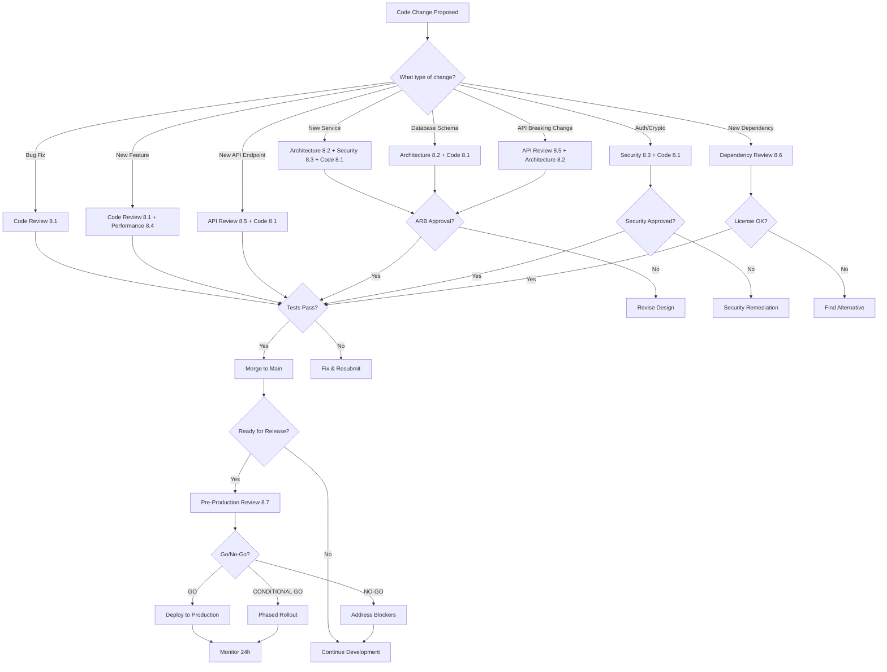
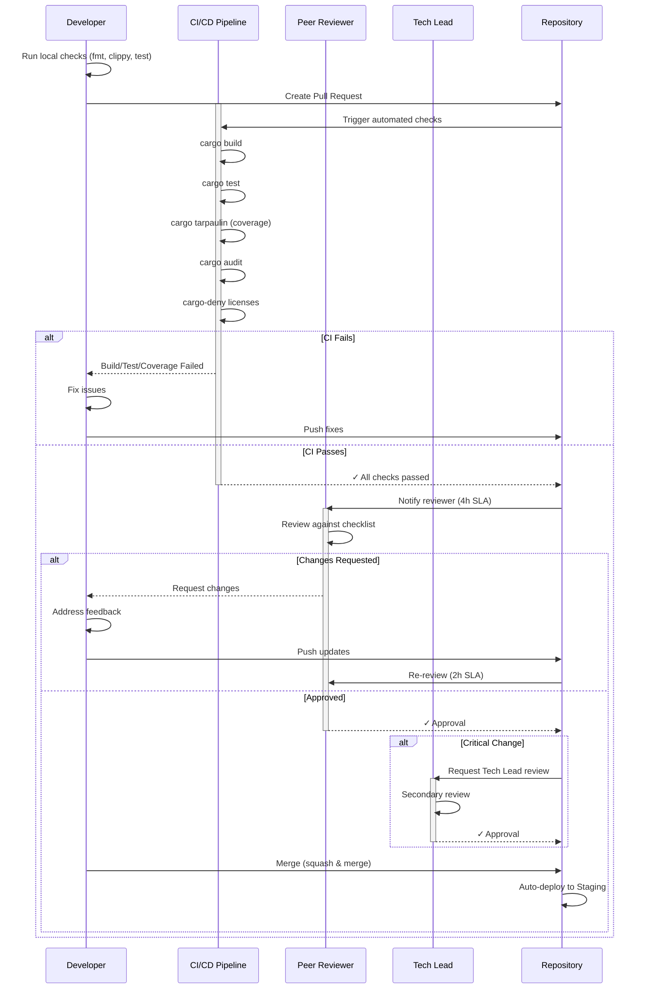
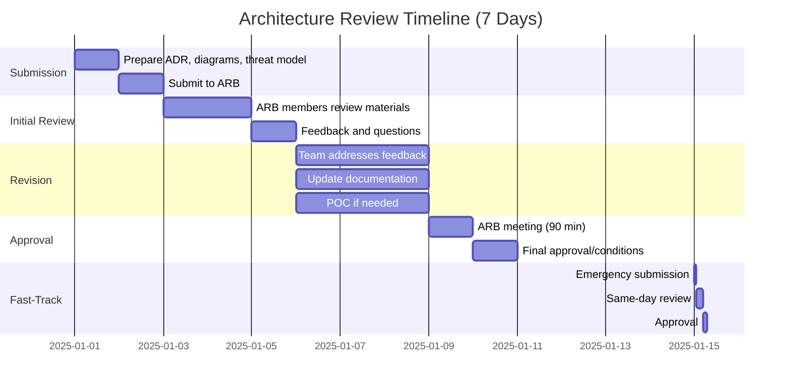
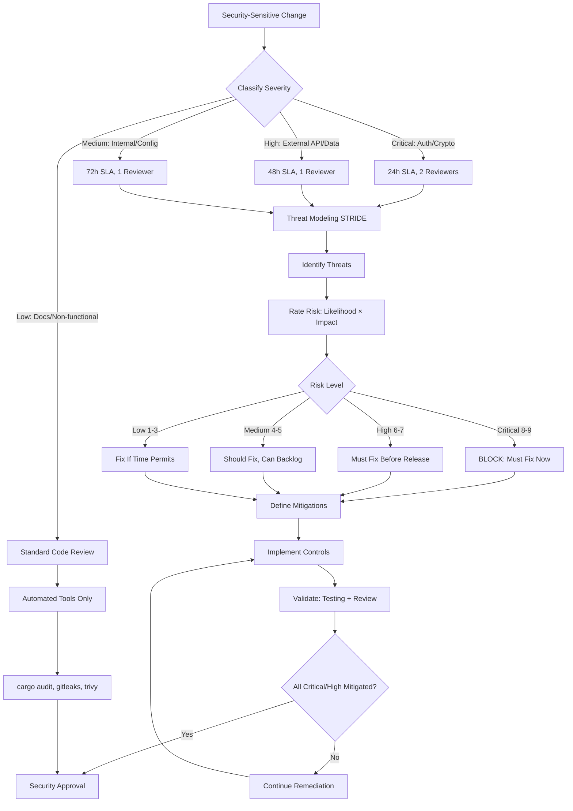
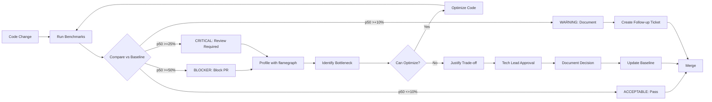
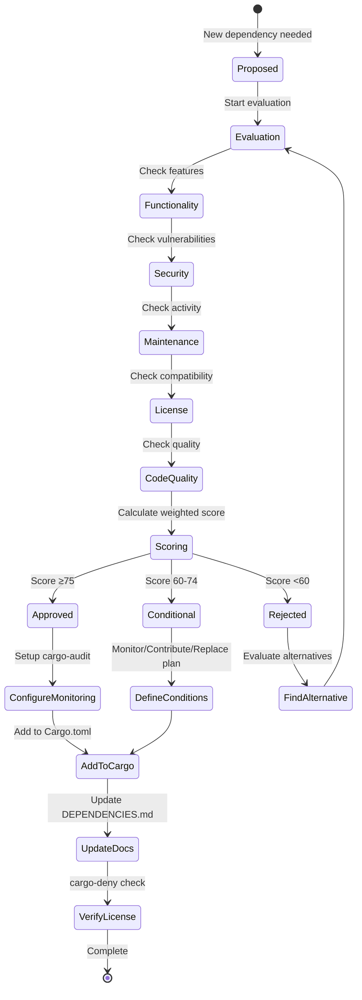
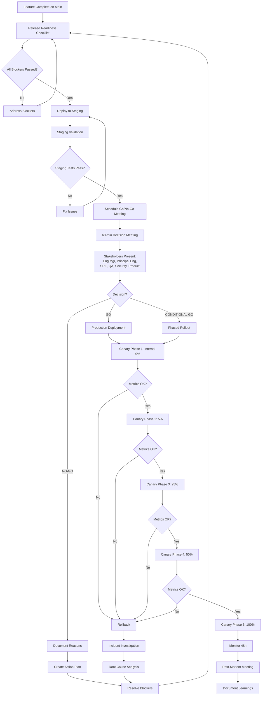
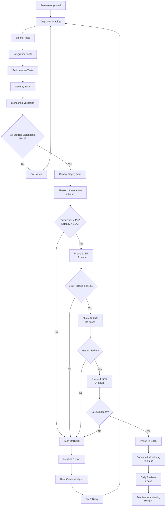
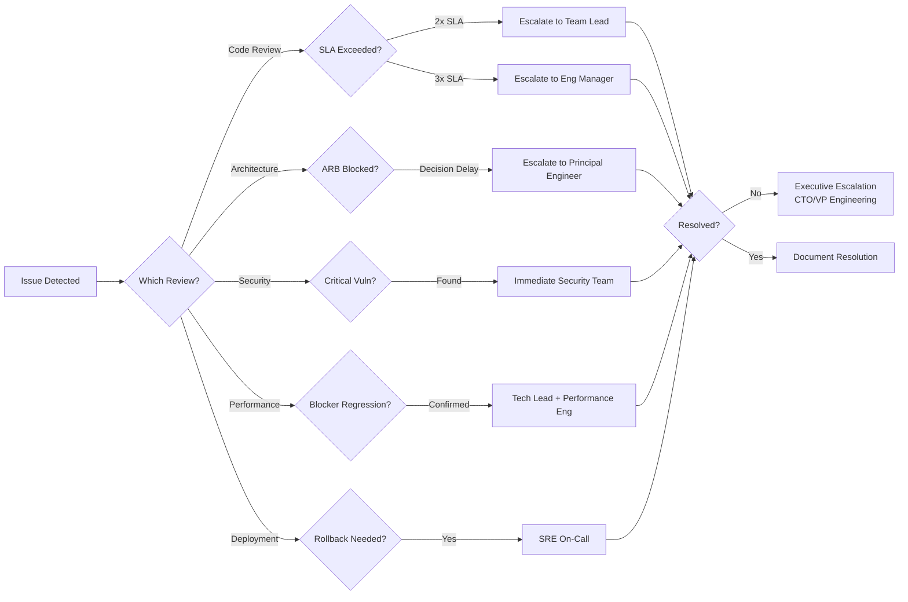

# Review Processes - Visual Workflow Diagrams

## Overall Review Decision Tree



## Code Review Workflow (8.1)



## Architecture Review Workflow (8.2)



## Security Review Workflow (8.3)



## Performance Review Workflow (8.4)



## Dependency Review Workflow (8.6)



## Pre-Production Review Workflow (8.7)



## Review SLA Timeline

```mermaid
gantt
    title Review SLAs by Priority
    dateFormat  HH:mm
    axisFormat %H:%M

    section Critical
    Initial Response (1h)          :crit1, 00:00, 1h
    Review & Approval (2h total)   :crit2, after crit1, 1h

    section High Priority
    Initial Response (2h)          :high1, 00:00, 2h
    Review Iterations              :high2, after high1, 2h
    Final Approval (4h total)      :high3, after high2, 0h

    section Normal
    Initial Response (4h)          :norm1, 00:00, 4h
    Review Iterations              :norm2, after norm1, 12h
    Re-review (2h)                 :norm3, after norm2, 2h
    Final Approval (24h total)     :norm4, after norm3, 6h
```



## Deployment Validation Flow



## Escalation Paths



## Metrics Dashboard View

```
┌─────────────────────── Code Review Metrics ───────────────────────┐
│                                                                    │
│  Avg Cycle Time: 18h ────────────────── ✓ Target: <24h           │
│  First Response: 3.2h ──────────────── ✓ Target: <4h              │
│  Approval Rate: 97% ────────────────── ✓ Target: >95%             │
│  Review Iterations: 2.1 ───────────── ✓ Target: <3                │
│                                                                    │
└────────────────────────────────────────────────────────────────────┘

┌─────────────────────── Performance Metrics ───────────────────────┐
│                                                                    │
│  p50 Latency: 18ms ───────────────────── ✓ Target: <20ms          │
│  p99 Latency: 92ms ───────────────────── ✓ Target: <100ms         │
│  Throughput: 5,200 req/s ───────────── ✓ Target: >5,000           │
│  CPU Usage: 65% ──────────────────────── ✓ Target: <70%           │
│  Memory: 850MB ───────────────────────── ✓ Target: <1GB           │
│                                                                    │
└────────────────────────────────────────────────────────────────────┘

┌─────────────────────── Security Metrics ──────────────────────────┐
│                                                                    │
│  Critical Vulns: 0 ─────────────────── ✓ Target: 0                │
│  High Vulns: 0 ────────────────────── ✓ Target: 0                 │
│  Audit Pass Rate: 100% ────────────── ✓ Target: 100%              │
│  License Compliance: ✓ ────────────── ✓ All deps compliant        │
│  Secrets Detected: 0 ──────────────── ✓ Target: 0                 │
│                                                                    │
└────────────────────────────────────────────────────────────────────┘

┌─────────────────────── Deployment Metrics ────────────────────────┐
│                                                                    │
│  Deployment Frequency: 2.5/week ──── ✓ Target: ≥2/week            │
│  Lead Time: 3.2 days ────────────── ✓ Target: <5 days             │
│  Change Failure Rate: 4% ───────── ✓ Target: <5%                  │
│  MTTR: 45 minutes ──────────────── ✓ Target: <1 hour              │
│  Rollback Rate: 2% ─────────────── ✓ Target: <5%                  │
│                                                                    │
└────────────────────────────────────────────────────────────────────┘
```

---

## Diagram Usage Guide

### For Onboarding
- **Start with**: Overall Review Decision Tree
- **Then review**: Specific workflow for your role (Dev → Code Review, Arch → Architecture Review)
- **Reference**: SLA Timeline for expectations

### For Daily Work
- **Quick lookup**: Review Decision Tree to determine which reviews needed
- **Process questions**: Follow specific workflow diagram (e.g., Code Review Workflow)
- **Time planning**: Reference SLA Timeline

### For Incident Response
- **Use**: Escalation Paths diagram
- **Then**: Deployment Validation Flow if rollback needed
- **Document**: Using templates referenced in workflows

### For Leadership
- **Monitor**: Metrics Dashboard View
- **Review**: Pre-Production Review Workflow for release decisions
- **Analyze**: Deployment Validation Flow for process improvements

---

**File**: `/workspaces/llm-research-lab/review-processes-workflow-diagram.md`

**Tools for Viewing**:
- GitHub/GitLab: Renders Mermaid diagrams natively
- VS Code: Markdown Preview Mermaid Support extension
- Draw.io: Import Mermaid code
- Mermaid Live Editor: https://mermaid.live

**Integration**:
- Include in team wiki for quick reference
- Print SLA Timeline for team workspace
- Use Escalation Paths in incident runbooks
- Reference Metrics Dashboard for sprint reviews
